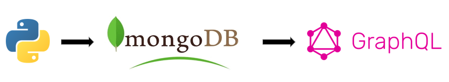
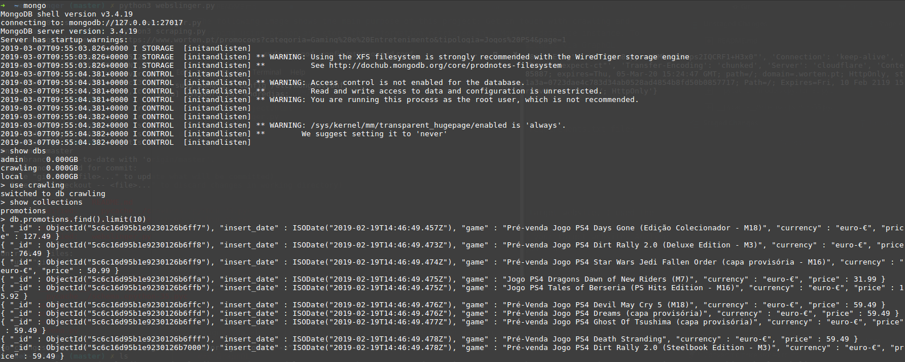
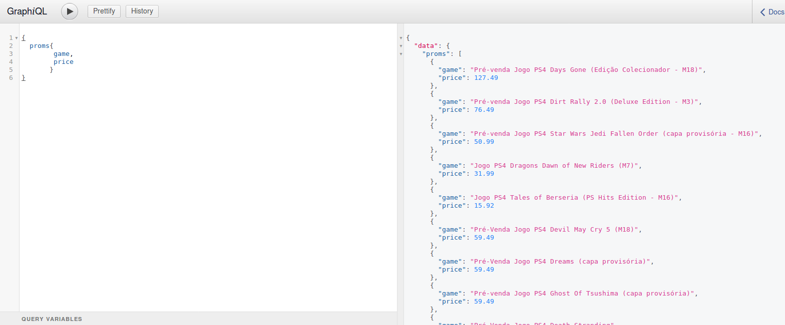

# web-slinger
This project is based on Web Scraping/Crawling of PS4 games in promotion state from a well known portuguese store website using Python. It's main purpose is to retrieve their names and current price and store them in a MongoDB database.

## Project Overview
The following image shows the main purpose of this project: Get in touch with crawling and scraping using python and store the information retrieved in a MongoDB database instance. To finish the project, data from MongoDB will be integrated and made available via GraphQL.

<p align="center">

</p>

## Prerequisites
To have all the dependencies used installed in your computer use the requirements.txt file:
```
pip install -r requirements.txt
```
## Testing

### Web Scraping and Crawling with Python
The first part of the project was based on crawling and scraping the target website. I used the Requests library to work with the HTTP requests and BeautifulSoup to scrap the every single website page. The code is very simple and you can modify it to use in your target website. Analyze the soup_object file created and scrap the info that you want. Then just run:

```
python webslinger.py
```

### MongoDB
After running the file above, all the games and prices information were retrieved and stored in a MongoDB database. At this point we have created a collection in a MongoDB Database, where we can query, manipulate or add any kind of data.

<p align="center">

</p>

### GraphQL
The last part of this project consisted in making data stored in MongoDB available via GraphQL. To do this, i've used MongoEngine to create data objects from my MongoDB stored information, Graphene to create the GraphQL types and schema and Flask to test and work with the queries. Simply run:
```
python app.py
```
Go to http://localhost:5000/graphql and you should come up with something like this:
<p align="center">

</p>
